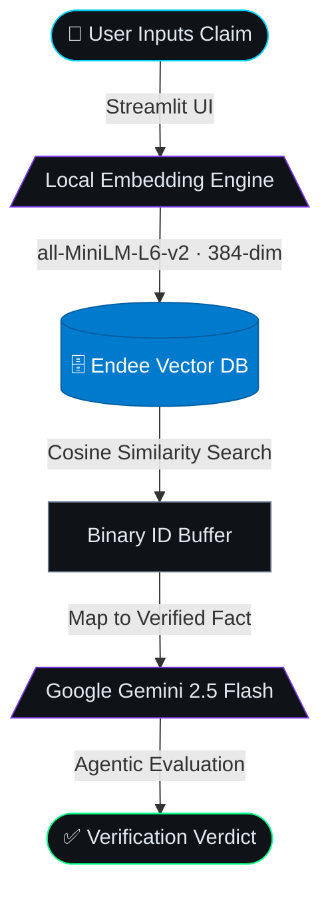

# 🛡️ Veritas: Agentic Fact-Checking System

<div align="center">


**Real-time claim verification powered by semantic vector search and agentic AI**

[](https://python.org)
[](https://streamlit.io)
[](https://endee.io)
[](https://ai.google.dev)
[](https://docker.com)
[](LICENSE)

</div>

---

## 📖 Overview

**Veritas** is a production-grade **Retrieval-Augmented Generation (RAG)** pipeline built to combat misinformation through real-time claim verification. Unlike systems that rely on an LLM's internal (and potentially hallucinated) memory, Veritas forces the AI to ground every analysis strictly on **verified facts retrieved dynamically** from the Endee Vector Database.


---

## 🧠 System Architecture



### Pipeline Stages

| Stage | Component | Description |
|-------|-----------|-------------|
| **01** · Input | Streamlit UI | User submits a factual claim via the dashboard |
| **02** · Embed | `all-MiniLM-L6-v2` | Claim is vectorized locally into 384 dimensions |
| **03** · Retrieve | Endee Vector DB | Cosine similarity search returns the closest verified fact |
| **04** · Map | Fact Store | Binary buffer ID is resolved to a human-readable fact |
| **05** · Generate | Gemini 2.5 Flash | LLM evaluates the claim *strictly* against retrieved context |
| **06** · Verdict | Veritas Engine | Returns `VERIFIED`, `DISPUTED`, or `INCONCLUSIVE` |

---

## ⚡ How Endee is Utilized

This project uses **Endee** as the sole retrieval engine — no external vector services, no fallback to LLM memory.

### Deployment
Endee was deployed via Docker pulling the official `endeeio/endee-server:latest` registry image, bypassing local C++ compilation while maintaining AVX2 hardware optimizations.

```bash
docker run -d \
  -p 8080:8080 \
  -v endee-data:/data \
  -e NDD_NUM_THREADS=0 \
  --name endee-server \
  endeeio/endee-server:latest
```

### Data Ingestion
Facts are vectorized into 384 dimensions and inserted via the REST API:

```
POST /api/v1/index/create        → Provision new index (veritas_local_384)
POST /api/v1/index/<name>/vector/insert → Store vector + metadata
```

### Semantic Search
Every user query triggers a real-time vector search:

```
POST /api/v1/index/<name>/search → Returns binary memory buffer with top-k IDs
```

Endee calculates cosine similarity and returns a highly-optimized binary buffer — demonstrating its focus on raw retrieval throughput over verbose JSON responses.

---

## 🔬 Advanced: Hybrid Search Capabilities

While building the pipeline, the core C++ engine's internal test suite (`tests/filter_test.cpp`) revealed an **undocumented MongoDB-style JSON syntax** for metadata pre-filtering:

```cpp
// From tests/filter_test.cpp
json query = json::array({
    {{"city", {{"$eq", "Paris"}}}}
});
```

**Planned Enhancement:** Leverage this syntax to implement **Hybrid Search** — combining vector similarity with metadata pre-filtering, enabling Veritas to scope searches by claim category, source domain, or date before performing dense vector retrieval.

---

## 🛠️ Setup & Installation

### Prerequisites

- Docker Desktop (running)
- Python 3.10+
- Google Gemini API key → [Get one free](https://aistudio.google.com/apikey)

---

### Step 1 — Start the Endee Database

```bash
docker run -d \
  -p 8080:8080 \
  -v endee-data:/data \
  -e NDD_NUM_THREADS=0 \
  --name endee-server \
  endeeio/endee-server:latest
```

Verify it's running:
```bash
curl http://localhost:8080/api/v1/index/list
# Expected: {"indexes":[]}
```

---

### Step 2 — Set Up Python Environment

```bash
cd app
python3 -m venv venv
source venv/bin/activate          # Windows: venv\Scripts\activate

pip install streamlit \
            requests \
            sentence-transformers \
            google-genai \
            python-dotenv
```

---

### Step 3 — Configure Environment

Create a `.env` file inside the `app/` directory:

```env
GEMINI_API_KEY=your_actual_key_here
```

---

### Step 4 — Seed the Knowledge Base

Run the ingestion script to embed and insert verified facts into Endee:

```bash
python veritas_core.py
```

Expected output:
```
1. Setting up Endee Index...
   --> Success: Index created.
2. Inserting a verified fact...
   --> Insert Fact HTTP Status: 200
Pipeline Test Complete.
```

---

### Step 5 — Launch the Dashboard

```bash
streamlit run app.py
```

Open **[http://localhost:8501](http://localhost:8501)** in your browser.

---

## 🖥️ Dashboard Preview

```
╔══════════════════════════════════════════════════════════════╗
║  ◈ VERITAS              Agentic Fact-Checking System · v1.0  ║
║  ● SYSTEM ONLINE                                             ║
╠═══════════════════════════╦══════════════════════════════════╣
║  01 · CLAIM INPUT         ║  04 · PIPELINE LOG               ║
║  ─────────────────────    ║  ● vector_embedding  384-dim      ║
║  [Enter claim to verify]  ║  ● endee_retrieval   HTTP 200     ║
║                           ║  ● gemini_generation 1240ms       ║
║  ⟶ Execute Pipeline      ║  ● verdict           VERIFIED     ║
║                           ╠══════════════════════════════════╣
║  02 · SYSTEM CONFIG       ║  05 · RETRIEVED CONTEXT          ║
║  embedding  MiniLM-L6-v2  ║  > Bennett University is located  ║
║  vector_dim 384           ║    in Greater Noida, UP.          ║
║  similarity cosine        ╠══════════════════════════════════╣
║                           ║  06 · AGENTIC ANALYSIS           ║
║  03 · KNOWLEDGE BASE      ║  ✓ CLAIM VERIFIED                 ║
║  fact_001  Bennett Univ…  ║  The claim is FALSE. Bennett      ║
║                           ║  University is in Greater Noida,  ║
║                           ║  Uttar Pradesh — not Delhi.       ║
╚═══════════════════════════╩══════════════════════════════════╝
```

---

## 📁 Project Structure

```
endee_assignment/
├── app/
│   ├── app.py                  # Streamlit dashboard
│   ├── veritas_core.py         # Data ingestion pipeline
│   ├── .env                    # API keys (not committed)
│   └── venv/                   # Python virtual environment
├── src/                        # Endee C++ source (reference)
├── tests/
│   └── filter_test.cpp         # Endee filter syntax reference
├── third_party/                # Endee dependencies
├── docker-compose.yml
├── run.sh
├── install.sh
└── README.md
```

---

## 🔧 Tech Stack

| Layer | Technology | Purpose |
|-------|-----------|---------|
| **UI** | Streamlit | Interactive dashboard |
| **Embeddings** | `sentence-transformers` · `all-MiniLM-L6-v2` | Local 384-dim vectorization |
| **Vector DB** | Endee (`endeeio/endee-server`) | High-speed cosine similarity retrieval |
| **LLM** | Google Gemini 2.5 Flash | Agentic fact evaluation |
| **Runtime** | Docker | Endee server containerization |
| **Config** | `python-dotenv` | Environment variable management |

---

## 🗺️ Roadmap

- [x] Core RAG pipeline (embed → retrieve → generate)
- [x] Streamlit dashboard with pipeline execution log
- [x] Verdict detection (VERIFIED / DISPUTED / INCONCLUSIVE)
- [ ] Hybrid search with Endee metadata filtering
- [ ] Multi-fact knowledge base with bulk ingestion
- [ ] Confidence scoring per retrieved vector
- [ ] REST API wrapper for external integrations

---

## 📄 License

This project is licensed under the **Apache License 2.0**.
See the [LICENSE](LICENSE) file for full terms.

---

<div align="center">

Built with 🛡️ for accuracy · Powered by **Endee** + **Gemini**

</div>
